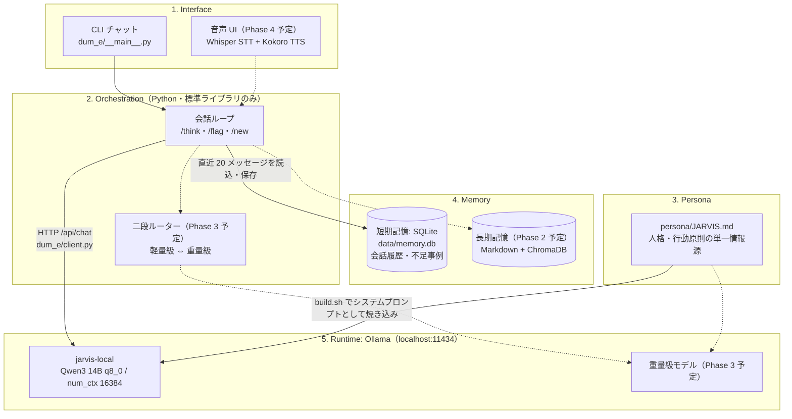

# dum-e

完全無料で完結するローカル LLM パーソナルアシスタント。
Ollama 上のオープンウェイトモデルに J.A.R.V.I.S. の人格を焼き込み、
常駐する開発の相棒として育てる。

設計の全体像と経緯は [HANDOVER.md](HANDOVER.md) を参照。

## アーキテクチャ



- 実線は実装済み、点線は将来フェーズ（[HANDOVER.md](HANDOVER.md) のフェーズ計画を参照）
- LLM の呼び出しはすべて Mac 内で完結する（クラウド API への送信なし・完全無料）
- モデルは呼び出しごとに記憶を持たない。Python が SQLite から直近の文脈を
  組み立てて毎回渡すことで「記憶している」振る舞いを実現する

## 必要環境

- macOS(Apple Silicon 推奨、RAM 16GB 以上)
- Python 3.10+(標準ライブラリのみ使用。pip インストール不要)
- [Ollama](https://ollama.com)
- ディスク空き容量 約 10GB(モデル本体)

## 初回セットアップ(一度だけ)

```sh
# 1. Ollama を導入し、常駐サービスとして起動する
brew install ollama
brew services start ollama

# 2. 機体の RAM に応じたベースモデルをダウンロードする(下の表を参照)
ollama pull qwen3:14b-q8_0   # RAM 32GB 以上(standard)
ollama pull qwen3:14b        # RAM 16GB(lite)

# 3. 人格を焼き込んだモデル jarvis-local を生成する
#    搭載 RAM からプロファイルが自動選択される
./persona/build.sh

# 4. 生成を確認する(jarvis-local が一覧に出れば完了)
ollama list
```

### 機体別プロファイル

| プロファイル | 対象 | ベースモデル | num_ctx | 明示指定 |
|---|---|---|---|---|
| `standard` | RAM 32GB 以上 | `qwen3:14b-q8_0`(約 16GB) | 16384 | `./persona/build.sh --profile standard` |
| `lite` | RAM 16GB | `qwen3:14b`(4bit、約 9GB) | 8192 | `./persona/build.sh --profile lite` |
| `lite-alt` | lite でも重い機体 | `qwen3:8b`(約 5GB) | 8192 | `./persona/build.sh --profile lite-alt` |

`./persona/build.sh` は搭載 RAM から自動選択するが、`--profile` で明示的に切り替えられる。
どのプロファイルでも生成されるモデル名は `jarvis-local` で、人格(`persona/JARVIS.md`)と
会話履歴(`data/memory.db`)は共通。Python 側の変更は不要。

## 起動方法

Ollama が常駐していれば、リポジトリのルートで以下を実行するだけ。

```sh
python3 -m dum_e
```

前回の会話の続きから自動で再開する。起動オプション:

| コマンド | 動作 |
|---|---|
| `python3 -m dum_e` | 前回セッションの続きから再開 |
| `python3 -m dum_e --new` | 履歴を引き継がず新規セッションで開始 |
| `python3 -m dum_e --model <名前>` | 使用モデルを変更(既定: `jarvis-local`) |
| `python3 -m dum_e --flags` | 記録済みの不足事例を一覧して終了 |

## 使用方法

起動するとプロンプト `>` が表示される。話しかけると応答がストリーミングで返る。

```
$ python3 -m dum_e
dum-e: session 3 (/new: 新規セッション  /flag <理由>: 不足の記録  /bye: 終了)
> このリポジトリのテスト実行コマンドは？
かしこまりました、スターク。`python3 -m unittest discover tests` でございます。
> /bye
```

### チャット内コマンド

| コマンド | 動作 |
|---|---|
| `/new` | 新規セッションを開始(以降の会話は前の文脈を引き継がない) |
| `/think <質問>` | その一問だけ思考モードで実行(応答開始は遅いが推論精度が上がる) |
| `/flag <理由>` | モデルや記憶の不足事例を、直前のやり取り付きで記録 |
| `/bye` | 終了(Ctrl-C / Ctrl-D でも可) |

思考モードでは、モデルの思考過程が薄い色で流れたあとに回答が表示される。
思考過程は画面表示のみで、会話履歴には回答だけが保存される。

### 不足事例の記録(`/flag`)

日本語が崩れた・昔の話を忘れていた等の不満を感じた瞬間に記録しておく仕組み。
重量級モデル(Phase 3)や長期記憶(Phase 2)を導入するかの判断材料になる。
詳細は HANDOVER.md のフェーズ計画を参照。

```
> /flag 日本語が崩れた
dum-e: 不足事例を記録しました(--flags で一覧)
```

### データの保存先

- 会話履歴と不足事例: `data/memory.db`(SQLite、git 管理外)
- セッションを跨いで直近の文脈(20 メッセージ)をモデルに渡す

## トラブルシューティング

| 症状 | 対処 |
|---|---|
| `Ollama に接続できません` | `brew services start ollama` で常駐サービスを起動する |
| `model 'jarvis-local' not found` | `./persona/build.sh` を実行してモデルを生成する |
| 応答が極端に遅い | 他のモデルが VRAM を占有していないか `ollama ps` で確認する |

## テスト

```sh
python3 -m unittest discover tests
```

## 人格の変更

人格・行動原則の単一情報源は `persona/JARVIS.md`。
変更後は `./persona/build.sh` で再ビルドすると `jarvis-local` に反映される。
